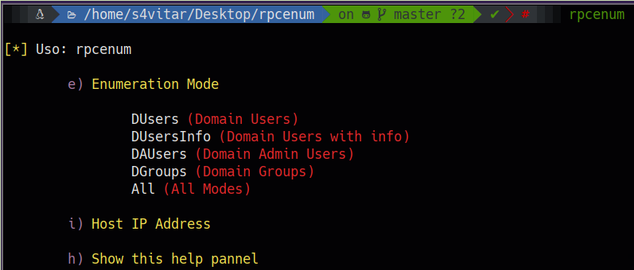

# RPCenum

Herramienta en Bash ideal para efectuar una enumeración básica y extraer la información más relevante de un dominio vía rpcclient. 

Esta utilidad nos permitirá obtener la siguiente información de un dominio:

* Usuarios del dominio
* Usuarios del dominio con información
* Usuarios administradores del dominio
* Grupos del dominio

¿Cómo funciona?
======
La ejecución de la herramienta mostrará el siguiente panel de ayuda:

	

