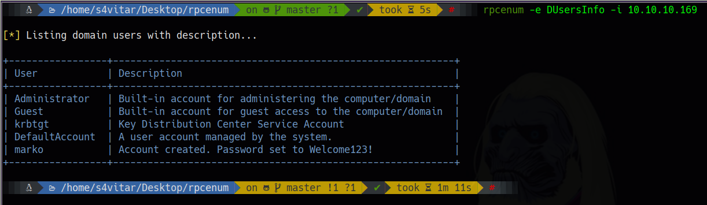
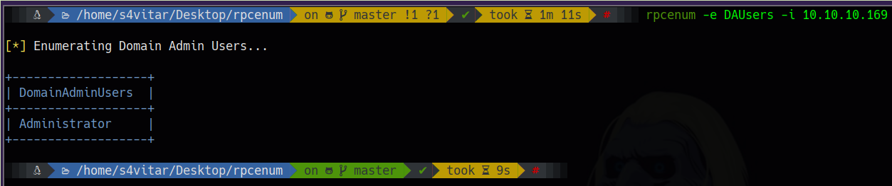
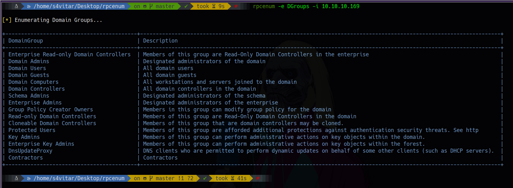

# RPCenumV2

**La versión V2, es un fork no oficial, para darle soporte a la herramienta a utilizar credenciales para enumerar RPC.**

Herramienta en Bash ideal para efectuar una enumeración básica y extraer la información más relevante de un dominio vía rpcclient. 

Esta utilidad nos permitirá obtener la siguiente información de un dominio:

* Usuarios del dominio
* Usuarios del dominio con información
* Usuarios administradores del dominio
* Grupos del dominio

¿Cómo funciona?
======
La ejecución de la herramienta mostrará el siguiente panel de ayuda:

	

Para su correcta ejecución, es necesario especificar el modo de enumeración a usar, siendo los representados en la imagen adjunta.

El modo de enumeración **DUsers**, nos permitirá obtener un listado de los usuarios existentes en el dominio (siempre y cuando el **Null Session** esté habilitado):

	

El modo de enumeración **DUsersInfo**, nos permitirá obtener un listado de los usuarios existentes en el dominio con descripción (siempre y cuando el **Null Session** esté habilitado), pudiendo así identificar a usuarios potenciales:

    

El modo de enumeración **DAUsers**, nos permitirá obtener un listado de los usuarios existentes administradores del dominio (siempre y cuando el **Null Session** esté habilitado). Esta parte es crucial, puesto que el atacante siempre va a ir en busca de las credenciales de estos, dado que poseen privilegio total sobre el dominio.

    

El modo de enumeración **DGroups**, nos permitirá obtener un listado de los grupos existentes del dominio (siempre y cuando el **Null Session** esté habilitado).

    

Por último, el modo de enumeración **All**, nos efectuará todas las enumeraciones de forma simultánea, pudiendo así visualizar la información más relevante del dominio.

